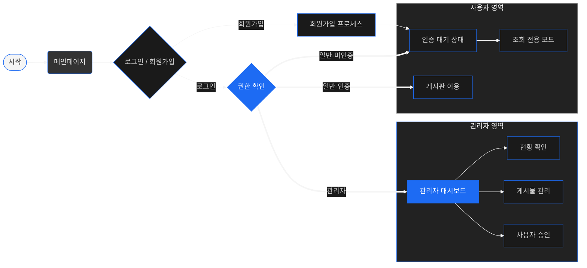

```mermaid
%%{init: {
    'theme': 'dark',
    'themeVariables': {
        'primaryColor': '#1D6BF3',
        'primaryTextColor': '#ffffff',
        'mainBkg': '#1A1A1A',
        'nodeBorder': '#1D6BF3',
        'lineColor': '#F5F5F5',
        'edgeLabelBackground':'#1A1A1A'
    }
}}%%
graph LR;

    %% 1. 진입부 (좌측 배치)
    Start([시작]) --> Main(메인페이지)
    Main --> Auth{로그인 / 회원가입}

    Auth -- 회원가입 --> Join[회원가입 프로세스]
    Join --> Wait[인증 대기 상태]

    %% 2. 핵심 분기 (중앙 배치)
    Auth -- 로그인 --> RoleCheck{권한 확인}

    %% 3. 관리자 영역 (우측 상단)
    subgraph Admin_System [관리자 영역]
        AdminDash[관리자 대시보드]
        AdminDash --> G1[현황 확인]
        AdminDash --> G2[게시물 관리]
        AdminDash --> G3[사용자 승인]
    end

    %% 4. 일반 사용자 영역 (우측 하단)
    subgraph User_System [사용자 영역]
        FullAccess[게시판 이용]
        Wait --> Limited[조회 전용 모드]
    end

    %% 5. 권한 분배 (길이를 조절해 박스 외부 유지)
    RoleCheck ===>|관리자| AdminDash
    RoleCheck ===>|일반-인증| FullAccess
    RoleCheck ===>|일반-미인증| Wait

    %% 스타일링
    style Start fill:#F5F5F5,color:#1A1A1A,stroke:#1D6BF3
    style RoleCheck fill:#1D6BF3,color:#fff,stroke:#fff,stroke-width:2px
    style Main fill:#333,color:#F5F5F5
    style AdminDash fill:#1D6BF3,color:#fff
    style Admin_System fill:#222,stroke:#1D6BF3,color:#F5F5F5
    style User_System fill:#222,stroke:#888,color:#F5F5F5
```
